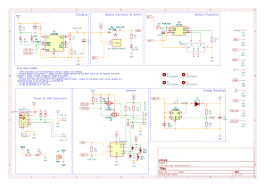

# mcu-bat-power

Battery power board for 5v compatible MCU boards featuring a LiFePo4 Holder

## Idea

This project is a battery supplied power circuitry to supply microcontroller projects with 5V battery power + the ability to charge and protect a LiFePo4 battery. In addition breakout for the USB data lines, voltage and current 
measurement as well as the sensing pins of the charging circuit are added so that a proper power management from
the microcontroller on an attached board is possible.

The concept of the board is to act as an add on board for a microcontroller board in a way that it can work for
several battery powered projects.

The idea is based on a Great Scott's video and materials of a [DIY LiPo Charge/Protect/5V Boost Circuit](https://www.youtube.com/watch?v=Fj0XuYiE7HU&t=618s)

## Components
This board includes a:

- LiFePo4 charging IC (CN3058E)
- Battery protection circuitry (HY2112 + FS8205)
- 5V Boost converter (MT3608 + passive components)
- A Micro USB socket to charge it conviniently from micro USB
- A power measurement circuit (INA219AxD with a 100mOhm sensing resistor)
- Leds for Power, Charging and Done
- A Power Switch
- Three connectors for other boards:
    - 5V/GND
    - Signals and Measuring:
        - Chargin and Done signal from the charging IC
        - I2C Bus for INA219A
        - VREF and GND connections to bring in the voltage level and power from a specific microcontroller
    - D+/D- from the USB Line

## Schematic & Board Layout

## Revision History:

- **v1.0**: Initial version (Produced: 13.03.2024) 
  This initial version includes a view additional features to enable better testing:
    - Test pads for all important voltage levels, signals and gnd
    - Additional pads to pass 5V power from a power supply
    - a bit more space (battery and circiutry are on the same side of the board)

